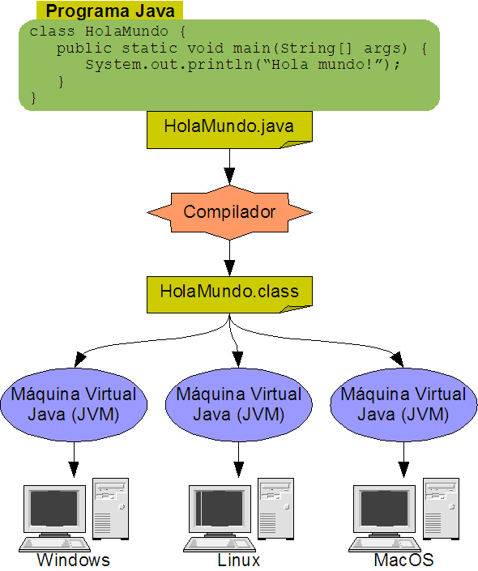
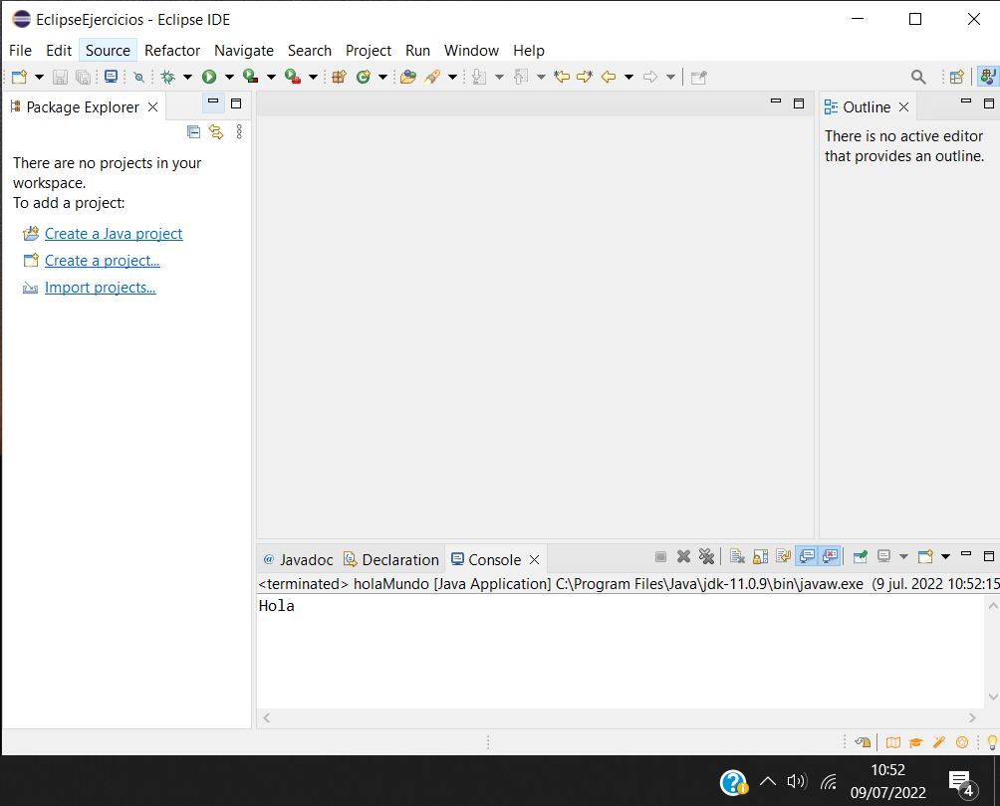

# UNIDAD 1.  ELEMENTOS DE UN PROGRAMA INFORMÁTICO

## INTRODUCCIÓN

¿Qué es un **programar**?

Programar es hacer programas. Obvio, ¿verdad? 

La siguiente pregunta sería entonces: ¿Que es un programa?

Un **programa** es una secuencia de instrucciones escritas para realizar una tarea específica con un ordenador.

Se plantea un problema, se idea una solución, se traduce a un lenguaje de programación y el ordenador lo ejecuta.

**Algoritmo** es un esquema para resolver cierto tipo de problema. Un algoritmo son los pasos que hay que dar para resolver un problema.
Un algoritmo se puede traducir en un programa para que el ordenador pueda entenderlo y ejecutarlo.

Un algoritmo está compuesto de:

* Entrada: datos del problema a resolver
* Salida: el resultado de la resolución
* Proceso: pasos a seguir para la resolución

Y un algoritmo se caracteriza porque ha de ser:

* Preciso: orden estricto + expresiones precisas 
* Definido: con la misma entrada, siempre resulta la misma salida
* Finito: número finito de pasos

Pasos para la resolución de un problema con ordenador:

* Diseño de un algoritmo
* Codificación de un programa
* Ejecución y validación

Será más fácil si lo vemos con un ejemplo:

Imagínate que el problema que se plantea es que tenemos que sumar dos números para averiguar el resultado. En primer lugar tenemos como datos de entrada los dos números concretos que queremos sumar, el proceso será realizar la suma de ambos números y la salida será mostrar el resultado de dicha suma.

Resumido en un esquema sería así:

- Problema: Sumar dos números
- Solución: 
    - Entrada: dos números
    - Salida: guardar la suma en la memoria y imprimirla por pantalla
    - Proceso: 
        - Pedir los dos números 
        - Calcular la suma y guardar el resultado en la memoria
        - Imprimir el resultado por pantalla

## LENGUAJE JAVA Y ENTORNO DE DESARROLLO

El lenguaje que vamos a utilizar es Java. Java es un lenguaje de programación que se desarrolló para satisfacer las nuevas necesidades que requería la creación de aplicaciones a principios de los 90. 


El lenguaje en sí mismo toma mucha de su sintaxis de C y C++, pero tiene un modelo de objetos más simple y elimina herramientas de bajo nivel, que suelen inducir a muchos errores.


Se buscaban principalmente dos cosas:

* Fácil de aprender:
    * Simple
    * Similitud de sintaxis con C y C++ pero más sencillo al eliminar características como punteros.
* Trabajar de forma eficiente
    * Orientado a objetos
    * Robusto y seguro
    * Arquitectura portable: gracias a la máquina virtual de Java
    * Multitarea

### Ejecución de programas en Java

#### JRE y JDK.



Para poder ejecutar un programa Java es necesario tener instalado en el equipo una máquina virtual Java. Se trata de un programa que traduce las instrucciones compiladas del programa Java al lenguaje máquina que corresponda, según la plataforma bajo la que se ejecute el programa. 

Sun proporciona de forma gratuita una máquina virtual Java con el nombre Java Runtime Environment (JRE) que puede descargarse desde la web de Java, buscando la versión correspondiente al sistema operativo sobre el que se desea ejecutar el programa.

Os dejo un enlace por si queréis consultar un poco de la historia de Java y consultar las versiones.

[Enlace a la wikipedia](https://es.wikipedia.org/wiki/Java_(lenguaje_de_programación))

Tenemos que distinguir entre el JRE de Java y el JDK de Java. Para ello vamos a echar un vistazo al siguiente enlace:

    [Enlace a la página de Java](https://www.java.com/es/download/help/techinfo_es.html)

Una vez que nos ha quedado clara la diferencia entre JRE y JDK, vamos a instalar el JDK, que ya incluye el JRE. La versión que tendríamos que instalar es el último JDK LTS, es decir, la versión que Oracle asegura que va a tener soporte durante más tiempo. Para ello tenemos que ir a la siguiente página, descargar el archivo elegido, e instalarlo en nuestro equipo.

[Enlace a la página de Oracle](https://www.oracle.com/java/technologies/downloads/)

En nuestro caso vamos a instalar el JDK 17, que es la última version LTS, y es la que recomienda Oracle instalar.

#### Entorno de desarrollo

Para que un programador pueda llevar a cabo su tarea, dispone de herramientas para llevar a cabo su tarea. Lo más básico es tener un editor de texto donde escribir las instrucciones y un compilador que transforme el fichero de texto, con las sentencias de Java, en un fichero escrito en un lenguaje especial, capaz de ser interpretado por la Máquina Virtual de Java (JVM).

También hay entornos de programación más sofisticados que proporcionan una enorme cantidad de funciones: editor de texto, ayuda, compilador, depurador y, en general, casi cualquier cosa que se nos pueda ocurrir. Estos entornos se conocen como IDE, las siglas en inglés de "entorno integrado de desarrollo".
Tenemos varios entornos disponibles, algunos de código abierto y gratuitos. Un ejemplo puede ser NetBeans, o Eclipse. En este curso vamos a utilizar Eclipse y la página de descarga es la siguiente:

[Enlace a la página de Eclipse](https://www.eclipse.org/downloads/)

## TAREA PARA REALIZAR EN CASA
Debéis instalar el JDK que estamos utilizando en clase, y el Eclipse en el equipo de casa. Tendréis que hacer capturas de pantalla donde se vea la fecha y hora para comprobar que la instalación está hecha, del estilo a estos dos recortes:




## PROGRAMACIÓN EN JAVA

El código Java se escribe en documentos de texto con extensión .java. Al ser multiplataforma se pueden utilizar sin problema símbolos como la eñe o las vocales con tilde a la hora de poner nombre a las variables, aunque yo no os lo recomiendo.
Consideraciones previas a tener en cuenta al escribir nuestros programas:
* Hay diferencia entre mayúsculas y minúsculas
* Cada línea debe terminar con ;
* Una instrucción puede abarcar más de una línea
* Los comentarios de una línea deben comenzar con // y si ocupan más de una línea deben comenzar con /* y terminar con */
```
/* Comentario
de varias líneas */
//Comentario de una línea
```
* A veces se marcan bloques de código, es decir, código agrupado. Cada bloque comienza con { y terminar con }
```
{
	...código dentro del bloque
}
código fuera del bloque
```
### Nuestro primer programa

```
public class PrimerPrograma
{
     public static void main(String[] args)
     {
          System.out.println(“¡Mi primer programa!”);
     }
}
```

La primera línea *public class PrimerPrograma* declara el nombre de la clase del código. Más adelante se explicará que significa el concepto de clase por ahora entenderemos que el nombre de la clase es el nombre del programa.

La línea *public static void main String args* sirve para indicar el inicio del método main. Este método contiene las instrucciones que se ejecutarán cuando el programa arranque.

La instrucción *System out println* sirve para escribir en pantalla. Como lo que escribimos es un texto, se encierra entre comillas.

Además, el archivo debería llamarse PrimerPrograma.java. Es recomendable que el nombre del programa (en realidad el nombre de la clase) y el del archivo coincidan.

También es aconsejable que el nombre del programa comience con una letra mayúscula y le sigan letras en minúsculas. Si consta de varias palabras no pueden utilizarse espacios en blanco.

### Paquetes en Java

En cualquier lenguaje de programación existen librerías que contienen código ya escrito que nos facilita la creación de programas. En el caso de Java no se llaman librerías, sino paquetes. Los paquetes son una especie de carpetas que contienen clases ya preparadas y más paquetes.

Para programar en Java se necesita instalar el kit de desarrollo de Java (la JDK). Este contiene los programas necesarios para compilar y ejecutar código Java. Pero además se incluyen miles de clases dentro de cientos de paquetes ya listos que facilitan la generación de programas.

Algunos paquetes sirven para utilizar funciones matemáticas, funciones de lectura y escritura, comunicación en red, programación de gráficos...

Por ejemplo la clase *System* está dentro del paquete *java.lang* (paquete básico) y posee el método *out.println* que necesitamos para escribir fácilmente por pantalla.

La sintaxis de esta instrucción es *import paquete.subpaquete.subsubapquete.clase*. Esta instrucción se coloca arriba del todo en el código.

### Variables en Java

Las variables son contenedores que sirven para almacenar los datos que utiliza un programa.  Ocupan un espacio en la memoria RAM del ordenador para almacenar el dato al que se refiere. Cuando utilizamos el nombre de la variable estamos haciendo referencia a un dato que está en memoria.
Las variables tienen un nombre (un identificador) que sólo puede contener letras, números (pero no puede empezar el nombre con un número) y el carácter de subrayado. 

**Declaración:** Antes de poder utilizarla es necesario declararla:
```
tipo nombreVariable;
```
Donde tipo es el tipo de datos que almacenará la variable (texto, números enteros,...) y nombreVariable es el nombre con el que se conocerá la variable. 
Ejemplos:
```
int días; // días es un número entero, sin decimales
boolean decisión; //decisión sólo puede ser verdadera o falsa
```
También se puede hacer que la variable tome un valor inicial al declarar:
```
int días=365;
```
Y se puede declarar más de una variable a la vez del mismo tipo en la misma línea si las separamos con comas:
```
int días=365, año=23, semanas;
```
Al declarar una variable se puede incluso utilizar una expresión:
```
int a=13, b=18;
int c=a+b; //es válido, c vale 31
```
Java es un lenguaje muy estricto al utilizar tipos de datos. Es un lenguaje fuertemente tipado: cada variable debe tener un tipo declarado.

**Asignación:** Una vez que tenemos la variable declarada, hay que darla un valor. Para ello se utiliza el símbolo =.
```
int x = 7;
```
Pero la asignación se puede utilizar en cualquier momento (tras haber declarado la variable):
```
int x;
x=7;
x=x*2;
```
En Java siempre se asigna una valor inicial a las variables en cuanto se declaran. En el caso de los números es el cero.
```
int x; //x ya vale cero
```
### Tipos de datos

Como ya hemos visto, para declarar una variable hay que indicar de que tipo será la información que esa variable va a guardar. Cuando indicamos el tipo de dato de una variable indicamos que tipo de dato puede guardar, y cuanta memoria se reserva para esa variable. Cuanta mayor sea la memoria interna que utiliza, mayor es el rango de posibles valores.

En Java tenemos 8 tipos de datos primitivos:

- 4 tipos para enteros: byte, short, int, long.
- 2 tipos para coma flotante: float, double.
- 1 tipo para booleanos: boolean.
- 1 tipo para carácter: char.

| Tipo | Tamaño | Rango |
| ------------- | ------------- | ------------- |
| byte  | 8  | -128 a 127 |
| short  | 16  | -32.768 a 32.767 |
| int  | 32  | -2.147.483.648 a 2.147.483.647 |
| long  | 64  | -9.223.372.036.854.775.808 a 9.223.372.036.854.775.8087 |
| float  | 32  | +/- 3.4E+38F (6-7 dígitos importantes) |
| double  | 64  | +/- 1.8E+308 (15 dígitos importantes) |
| boolean  | 16  | conjunto de caracteres UNICODE ISO |
| char  | 8 | True o False |

En este momento estamos en condiciones de hacer nuestro primer ejercicio en Java. Haremos el ejercicio 1 de la siguiente hoja de ejercicios:

[Hoja de ejercicios 1](ejercicios/Hoja01_Java_01.pdf)


