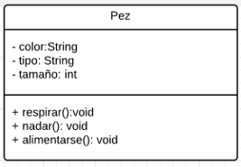
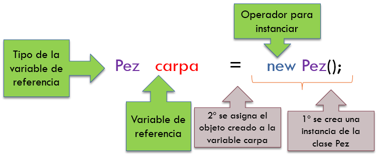

# UNIDAD 2. UTILIZACIÓN DE OBJETOS Y DESARROLLO DE CLASES

## INTRODUCCIÓN

Un paradigma es una forma de afrontar la construcción del software. O dicho con otras palabras, es una manera o estilo de programación de software. Existen diferentes formas de diseñar un lenguaje de programación y varios modos de trabajar para obtener los resultados que necesitan los programadores.

Existen varios paradigmas de programación, que se clasifican en:

- Declarativos
  - Funcional
  - Lógico
- Imperativos
  - Programación orientada a objetos
  - Procedimental

## JAVA Y LA PROGRAMACIÓN ORIENTADA A OBJETOS (POO)

Java es un lenguaje orientado a objetos. Siempre que se crea un programa, se necesita declarar una clase. Es decir, no podemos crear aplicaciones que no sean orientadas a objetos.

Con la POO los problemas se dividen en objetos. Cada uno de ellos funciona de forma totalmente independiente. 

Un objeto es un elemento del programa que integra sus propios datos y su propio funcionamiento. Es decir un objeto está formado por datos (propiedades) y por las funciones que es capaz de realizar el objeto (métodos).

Esta forma de programar se asemeja más al pensamiento humano. La cuestión es detectar adecuadamente los objetos necesarios. De hecho hay que detectar las distintas clases de objetos. 

Una clase es lo que define a un tipo de objeto. Al definir una clase lo que se hace es indicar como funciona un determinado tipo de objetos. Luego, a partir de la clase, podremos crear objetos de esa clase.

### Elementos de la POO: clases y objetos.

Una clase es un tipo al cual pertenecen **objetos** o **instancias de la clase**.

Las clases son plantillas para hacer objetos. Antes de definir un objeto se debe definir la clase a la que pertenece.


Una clase es una unidad de software que posee memoria y comportamiento. La memoria está representada por los **atributos** y el comportamiento está representada por los **métodos**.

Una clase es el “plano” que permite “construir” un objeto y está compuesta de:

- Atributos: Define sus propiedades (datos que almacena el objeto)
- Métodos: Define el código de sus métodos (comportamiento)

Dentro de la clase, existen unos métodos especiales denominados **constructores** que se utilizan cuando creamos un objeto a partir de una clase. A esta operación de crear el objeto también se la denomina instanciación del objeto. Los constructores tienen el mismo nombre de la clase.

Si representáramos la Clase pez en un diagrama de clases UML (Notación UML: Es un lenguaje de modelado de sistemas software. Entre otras cosas, se utiliza para representar diagramas de clases)



Veamos un ejemplo de como se representa una clase en lenguaje Java:

```
public class NombreClase
{
  /**
  * Atributos:
  *
  * tipo nombreAtributo1;
  * tipo nombreAtributo2;
  */
  
  /**
  * Métodos;
  *
  * salida nombreMetodo1 (parámetros)
  * {
  *   contenido del método 1
  * }
  * 
  * salida nombreMetodo2 (parámetros)
  * {
  *   contenido del método 2
  * }
  */
}
```

**Realiza el siguiente ejercicio:**

1. Intentad crear una clase Pez y codificar sus atributos y sus métodos.

```
public class Pez
{
  private String color;
  private String tipo;
  private int tamaño;
  
  public void respirar()
  {
    //contenido del método respirar
  }
   public void nadar()
  {
    //contenido del método nadar
  }
   public void alimentarse()
  {
    //contenido del método alimentarse
  }
}
```

#### Constructor

Una vez que ya tenemos hecha la clase Pez, vamos a ir completandola con un constructor. Como ya habíamos dicho, un constructor es un método especial que se utiliza para inicializar un objeto. 

Podemos tener más de un constructor en nuestra clase, y se distinguirán por el número de parámetros que tengan. A esta propiedad de poder tener más un método que se llama igual a otros se denomina **sobrecarga**.

El nombre del constructor, como ya habíamos dicho anteriormente, coincide con el nombre de la clase y no devuelve nada. Como esto siempre es así, no se indica que no devuelve nada. Los constructores se escriben inmediatamente después de la definición de los atributos. Completamos nuestra clase Pez:

```
  //Constructor por defecto (sin parámetros)
  public Pez()
  {
  }
  
  //Constructor que recibe un parámetro int
  public Pez(int _tamaño)
  {
    tamaño=_tamaño;
  }
  
  //Constructor que recibe tres parámetros
  public Pez (string miColor, String miTipo, int miTamaño)
  {
    color=miColor;
    tipo=miTipo;
    tamaño=miTamaño;
  } 
```

### Uso de clases y objetos

Una vez tenemos creada la clase, vamos a proceder a crear un objeto. A la creación de un objeto se la denomina instanciación del objeto, o crear una instancia de la clase.

Cada objeto tiene su propia identidad, es decir, tendrá un nombre único y no puede haber otro objeto con el mismo nombre. Cada objeto se referencia desde una variable.



Para utilizar un objeto primero se debe definir una variable que lo referenciará. El formato es el siguiente:

```
Clase variable
```
Luego se debe crear el objeto (instancia de la clase), de la siguiente forma:

```
variable = new Constructor(lista de parámetros)
```

Nota:
- La lista de parámetros son datos que se ha especificado como requeridos para crear el objeto.
- Una misma clase puede tener distintas especificaciones de parámetros requeridos para su instanciación, o podría no requerirlos.
- Los datos de la lista de parámetros se separan por comas

Mas ejemplos de creación de objetos de la clase Pez:
```
Pez carpa = new Pez();
Pez grande = new Pez(50);
Pez cometa = new Pez("Naranja", "Cometa", 8);
```

### La palabra reservada this

En todos los métodos existe por defecto una referencia al objeto concreto que ejecuta el método. Esta referencia es la palabra reservada this.
Su utilidad es resolver ambigüedades cuando existen atributos con el mismo identificador que alguna variable local o parámetro. Veamos un ejemplo de su uso:

```
public class Pez
{
  private int tamaño;
  
  public Pez(int tamaño)
  {
    this.tamaño=tamaño;
  }
}
```

### Métodos get y set

Sirven para obtener o para modificar los atributos de una clase

```
public String getColor(){
  return color;
}

public String getTipo(){
  return tipo;
}

public int getTamaño(){
  return tamaño;
}

public void setColor(String color){
  this.color=color;
}

public void setTipo(String tipo){
  this.tipo=tipo;
}

public void setTamaño(int tamaño){
  this.tamaño=tamaño;
}
```

### Operador "."

Se utiliza para acceder a los miembros de una clase

```
carpa.respirar();
grande.alimentarse();
pezCometa.respirar();
pezCometa.nadar();

carpa.setColor("Naranja");
carpa.setTamaño(30);
System.out.println("El color de la carpa es: "+ carpa.getColor());
```
## EJERCICIOS


